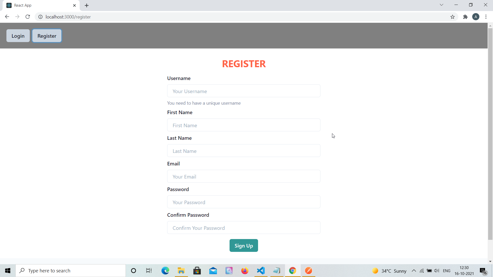
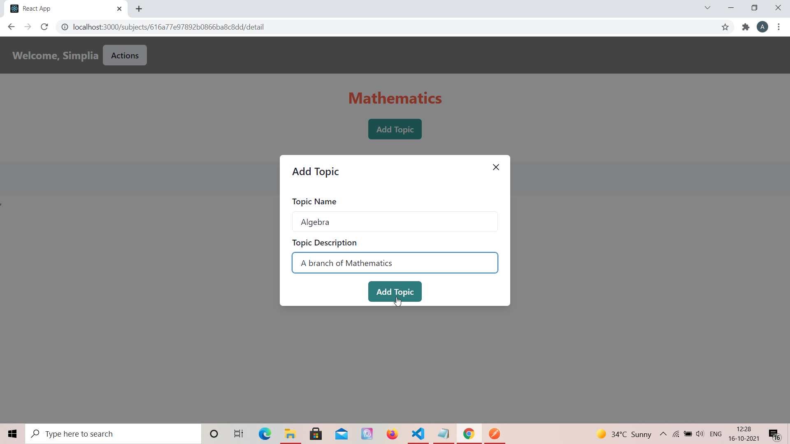
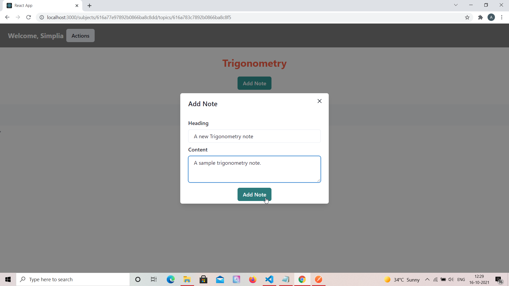
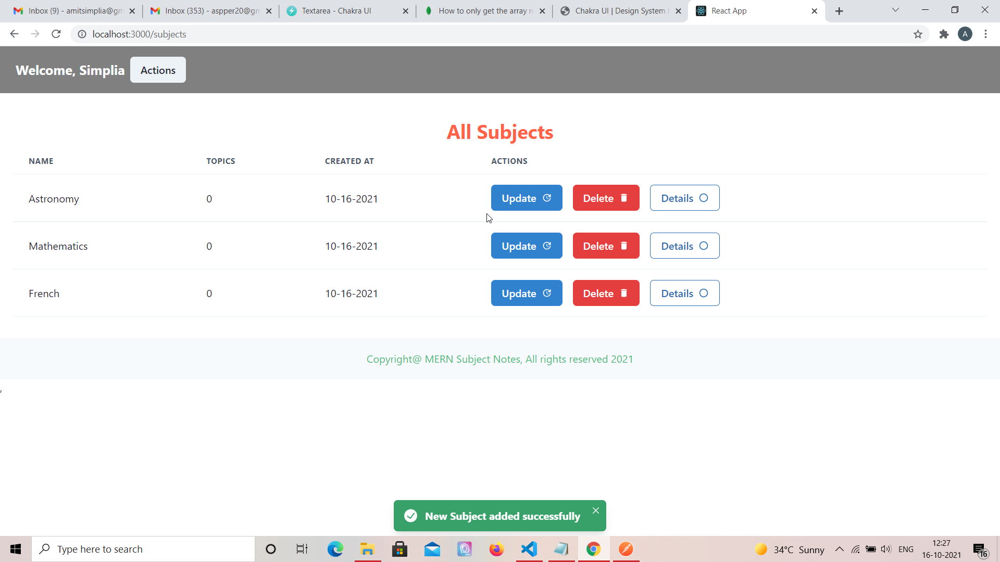
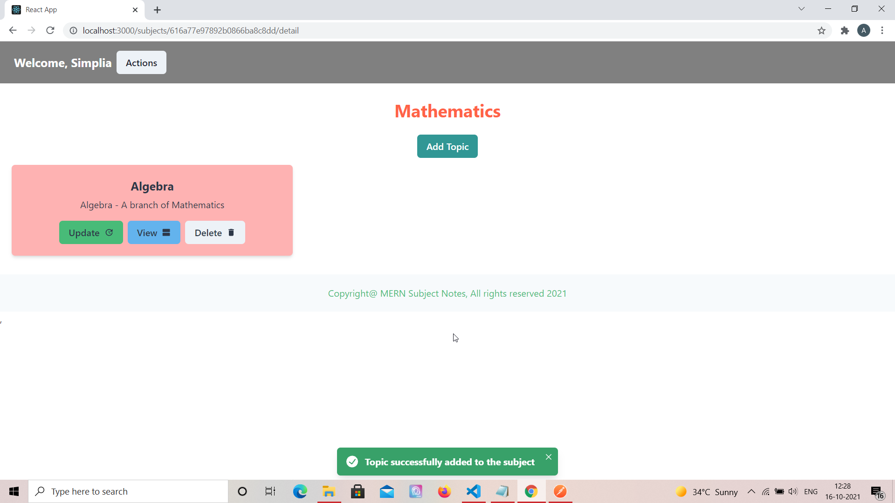
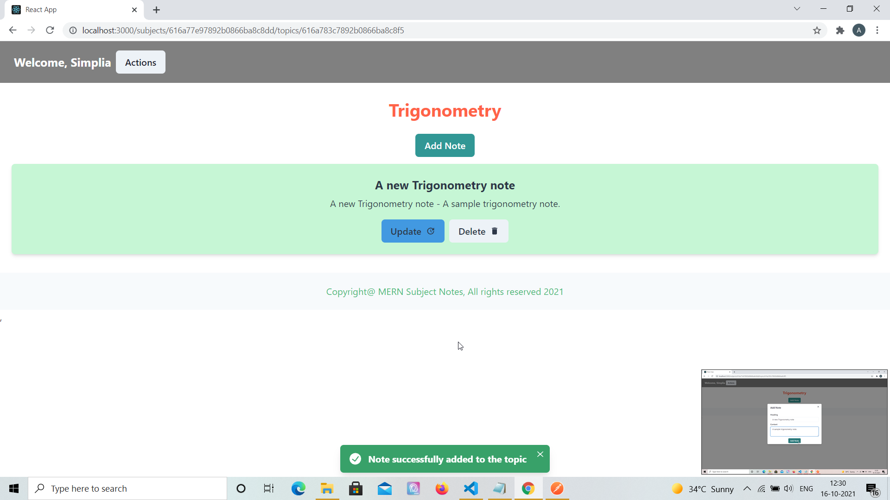
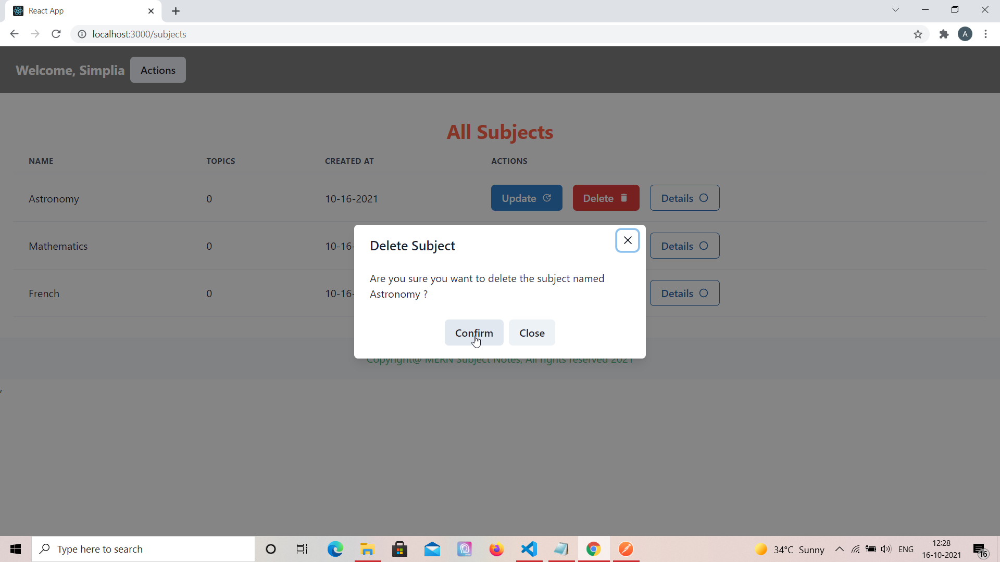

# MERN Subject Notes - Web application which simulates a Notebook

## Project Briefing

This is a notes tracking web application I built to keep tracks of note-worthy points categorized by subjects. It's created in one of the most popular full stack technologies combination known as MERN (MongoDB, Express, React, Node). 

## Features

- Contains token based user auth system. 
- Each user can perform CRUD on Subjects.
- Subjects would have Topics and Topics would have Notes, this would have CRUD operations for both of these modules.

## Built With

* [Express](https://expressjs.com/)
* [React](https://reactjs.org/)
* [MongoDB](https://www.mongodb.com/)
* [Redux](https://redux.js.org/)
* [Chakra UI Kit](https://getbootstrap.com/)

## Authors

* **Amit Prafulla (APFirebolt)** - (http://apgiiit.com/)

## Project setup

Simply install node modules for both frontend and backend, the project is already configured to serve build content files in production which is generated by Vue which resides inside the build folder.

Concurrently, package is used for development and allows us to launch both frontend and back-end in one go using single command. Proxy is used for API calls made to the Express server inside the React application using the config file.

```
npm install
npm run dev
```

For production, build the frontend of the app and then run the backend app only. 

```
npm run build
npm start
```

## Project Screenshots

Please find some of the screenshots of the application. Below is the screenshot of the Register Page.



Login Page.


Add Topic Modal, topics can be added within a subject through a modal. CRUD on Topics is supported



Add Note Modal, notes can be added within a topic through a modal. CRUD on Notes is supported



Subject list page, user after successful login can add subjects which would house topics and notes.



Subject detail page, would contain list of all the topics within a subject.



Topic detail page, would contain list of all the notes within a topic.



Delete Subject modal. Similar modals for CRUD operations exist for notes and topics.




